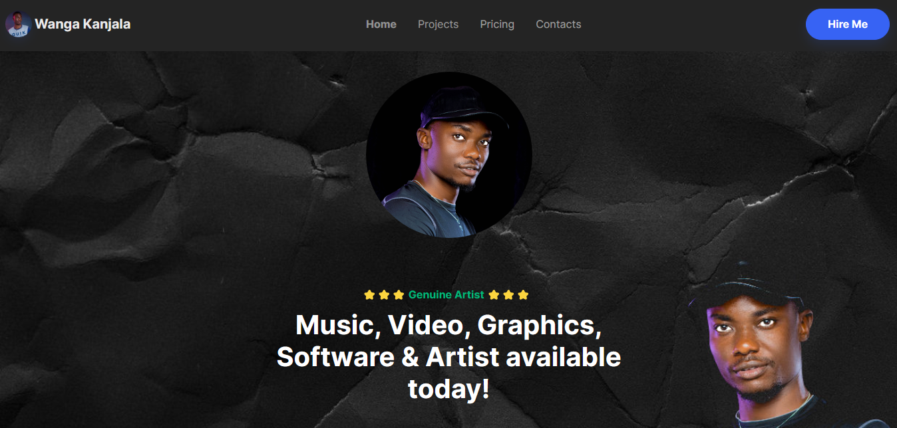
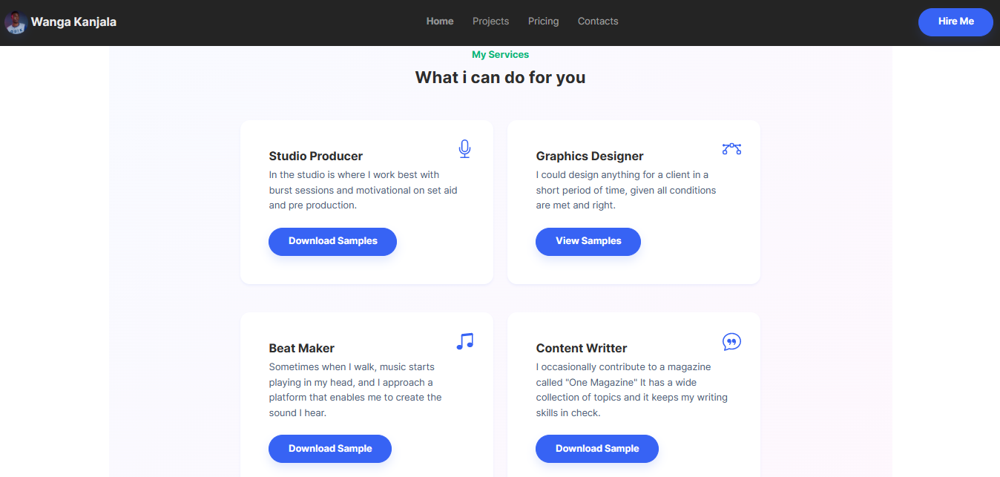
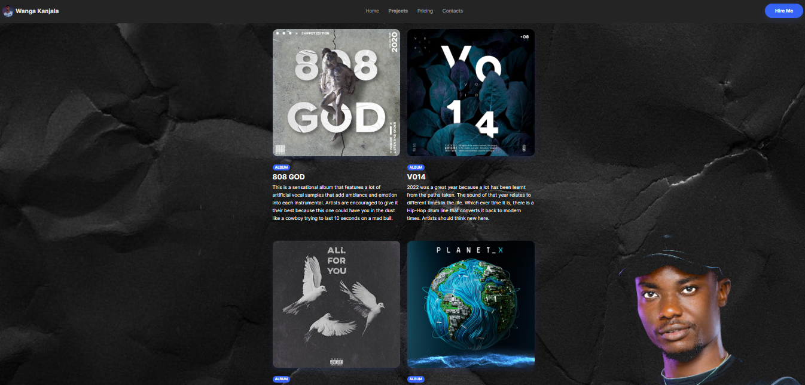
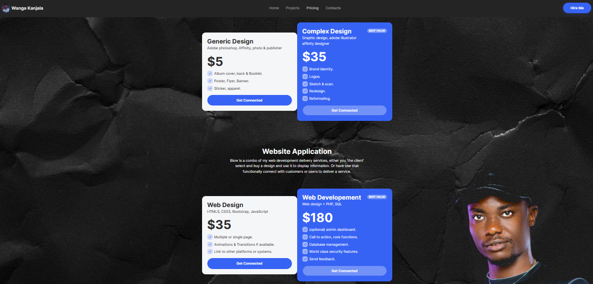
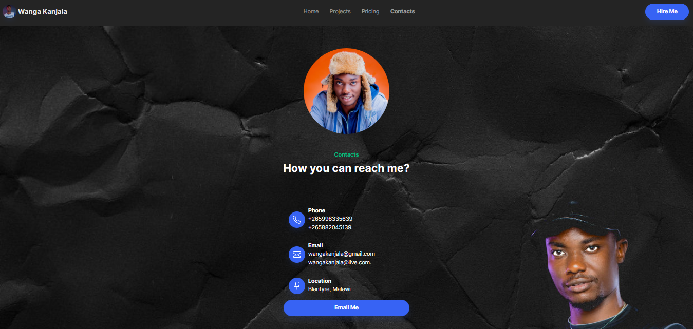

# Wanga Kanjala portfolio

This is a portfolio website, listing and describing my skill set via a more user friendly apporach. I have been trying to reach out to a wide range of people
possibly clients or collaborators, this is one of the attempts before I beleive the whole world is agaisn't my hustle. The work I do is not for fun and I take it
seriously and aim to set the bar higher when interacting with what I have to offer before time is lost.

## Homepage

My landing page is simple and realistic, it presents my skill set. This is to get the obvious facts out of the box so that I don't have clients scrolling all over the page for information and confirmation.

## Services

This page shows the basic information about each service i provide. These are the main services that I can provide with confidence and quality. A service is a project process that I take serviously so I have provided links to my previous projects.

## Projects

This is the projects page, it shows my previous projects in all fields, so far I have presented my musical content first followed by posters I have done with a couple of clients and some are inspired by self motivated elevation.

## Prices

This page shows how my services and products are priced, all projects require proper funding to come out with quality and satisfy the client. In most cases, some projects require a down payment which enables me to enhance my resources.

## Contacts

This page shows my basic contatcs that you can reach me through. Please no spam in my email. The button opens a call to action that launches your defailt email client using HTML.
